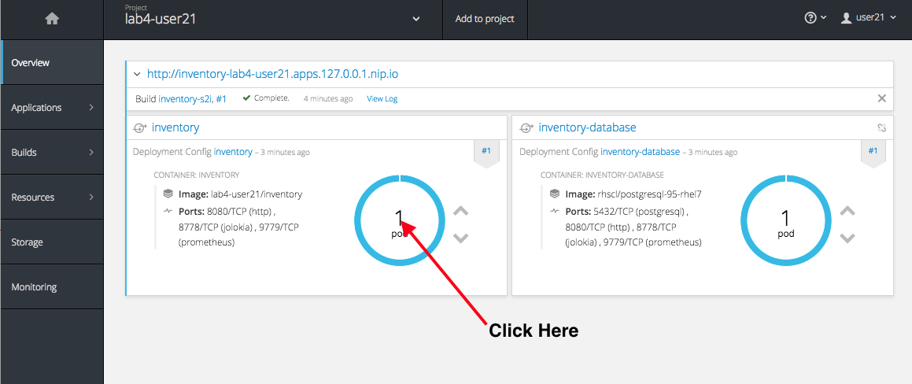
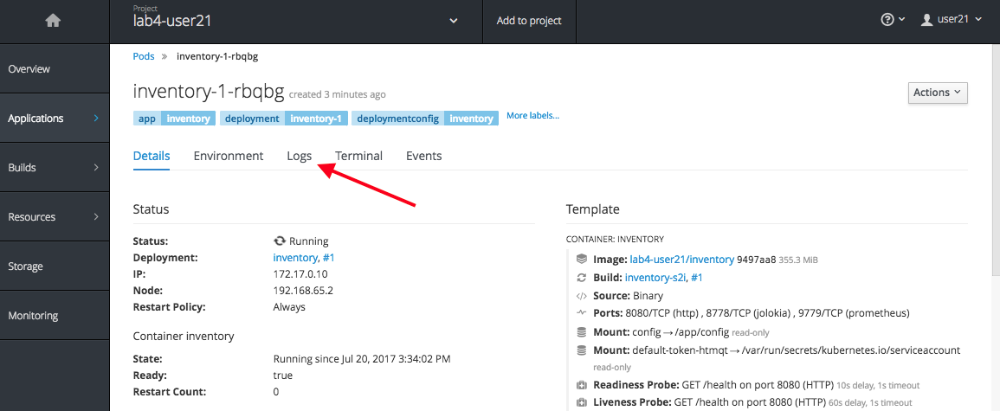
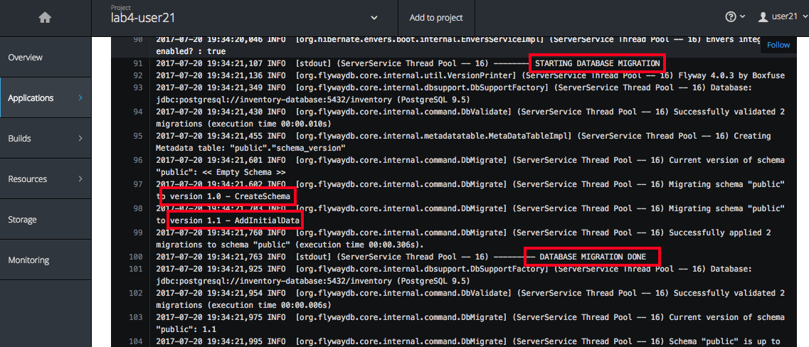
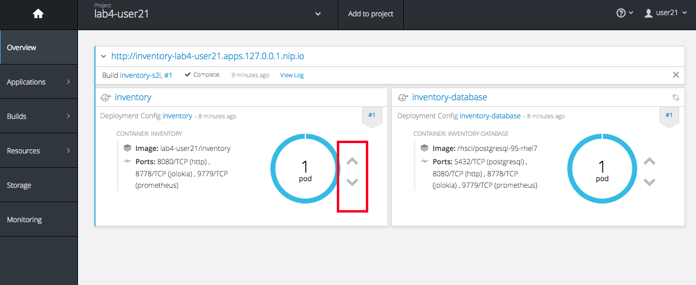
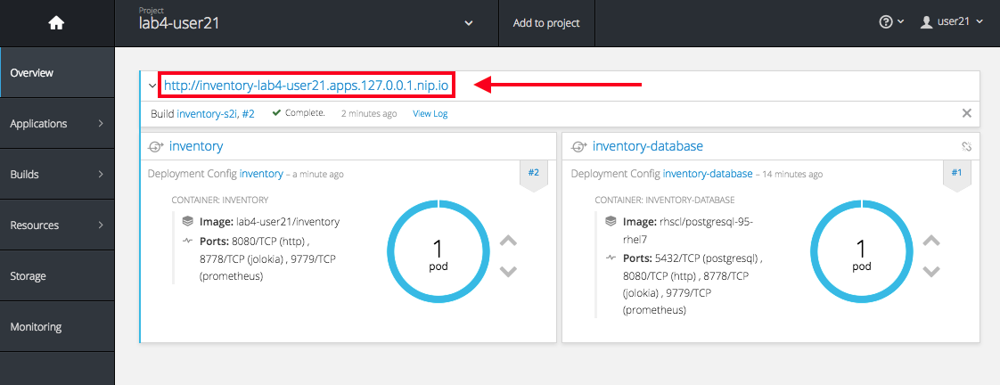
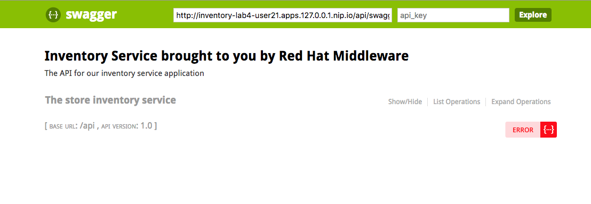
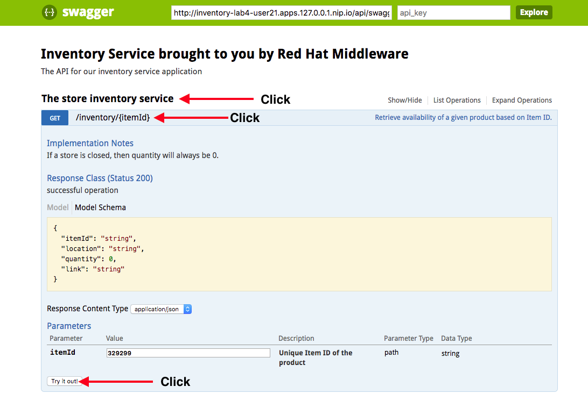
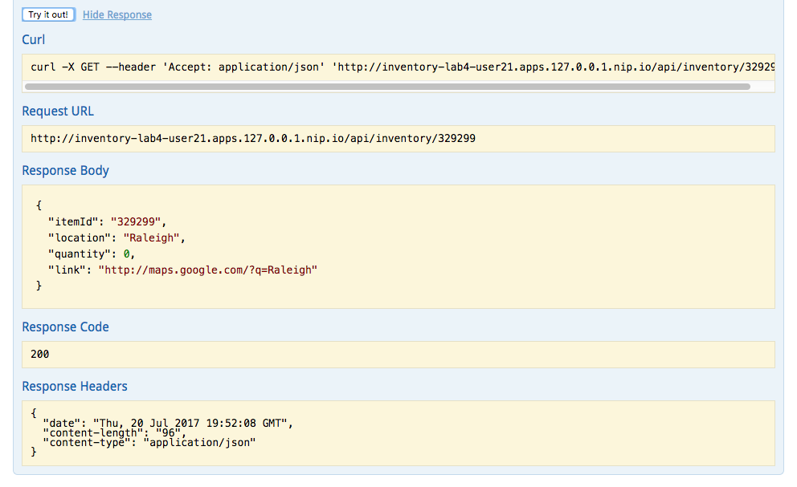

:noaudio:
:scrollbar:
:data-uri:
:toc2:

== Lab 4: Additional Fraction features with Swagger and Flyway

In this lab, you will explore additional features of WildFly Swarm that will prove useful for your cloud native
applications. You will apply these features to the now-familiar inventory service you've used in previous labs.

.Requirements

* Familiarity with Java programming
* Knowledge of OpenShift concepts

:numbered:

== Find lab4 project files

Each lab in this course is housed in separate directories. Using the command line, find and observe
the files for this lab:

    % cd $HOME/rhoar-enablement/lab4

IMPORTANT: Be sure to replace `$HOME` with the directory you chose to put the content in previous labs.

== Exercise: Flyway Database Migration

You may or may not have noticed, but up until now every time you re-start the inventory service, the database
is re-initialized with the fake inventory data. This is great for demos, not so much for real world applications,
especially those that are stateless, ephemeral, and will be started and restarted many times.

In earlier labs you added a persistent database (Postgres) to separate the data from the inventory service,
and now it is time to separate the data itself from the database (sort of).

http://flywaydb.org[FlyWay] automatically instruments your database with additional metadata, providing versioning and migration of your
schemas and tables. This allows you to cleanly maintain and update your database schemas and data across versions
of your app. It also allows you to easily initialize a new database to match your production database exactly,
which is important in continuous integration and continuous deployment, where you want to match your production
environment as closely as possible during earlier phases such as development, test, staging, etc.

FlyWay is easy to use with WildFly Swarm using the FlyWay Fraction. It automatically binds to the primary DataSource
if not configured or uses the provided URL/user/pass otherwise. It registers a ServletContextListener in the deployed
app to perform the operations like migration.

=== Break the database actions into separate versions

Separate the creation of the database schema from the initialization of data, and put them into two separate
versions:

. Create a new directory `src/main/resources/db/migration`:
[source, bash]
% mkdir -p src/main/resources/db/migration

. Within that directory, create a new file named `V1_0__CreateSchema.sql` with the following content:

[source, sql]
create table INVENTORY (
    itemId varchar(255) not null,
    link varchar(255),
    location varchar(255),
    quantity int4 not null, primary key (itemId)
);

This code is responsible for creating the database schema (if it doesn't already exist, as you'll see later on)

. Save the file

. Within the same directory, create another file named `V1_1__AddInitialData.sql` with the following content:

[source, sql]
insert into INVENTORY (itemId, link, location, quantity) values ('329299', 'http://maps.google.com/?q=Raleigh', 'Raleigh', 736);
insert into INVENTORY (itemId, link, location, quantity) values ('329199', 'http://maps.google.com/?q=Raleigh', 'Raleigh', 512);
insert into INVENTORY (itemId, link, location, quantity) values ('165613', 'http://maps.google.com/?q=Raleigh', 'Raleigh', 256);
insert into INVENTORY (itemId, link, location, quantity) values ('165614', 'http://maps.google.com/?q=Raleigh', 'Raleigh', 54);
insert into INVENTORY (itemId, link, location, quantity) values ('165954', 'http://maps.google.com/?q=Raleigh', 'Raleigh', 87);
insert into INVENTORY (itemId, link, location, quantity) values ('444434', 'http://maps.google.com/?q=Raleigh', 'Raleigh', 443);
insert into INVENTORY (itemId, link, location, quantity) values ('444435', 'http://maps.google.com/?q=Raleigh', 'Raleigh', 600);
insert into INVENTORY (itemId, link, location, quantity) values ('444436', 'http://maps.google.com/?q=Tokyo', 'Tokyo', 230);

This code initializes the data (if it doesn't already exist).

. Save the file

=== Add initialization code

To cause FlyWay to activate and apply migrations to the database when the app is started, you'll need to add some
code that is executed at startup.

. Create a new directory `src/main/java/com/redhat/coolstore/util/`:
[source, bash]
% mkdir src/main/java/com/redhat/coolstore/util

. Within the directory, create a new Java class file named `DataBaseMigrationStartup.java` with the following content:

[source, java]
----
package com.redhat.coolstore.util;

import org.flywaydb.core.Flyway;
import javax.annotation.PostConstruct;
import javax.ejb.Singleton;
import javax.ejb.Startup;

@Singleton
@Startup
public class DataBaseMigrationStartup {

    @PostConstruct
    private void startup() {
        System.out.println("-------- STARTING DATABASE MIGRATION");

        Flyway flyway = new Flyway();

        String dbConnUrl = System.getProperty("swarm.datasources.data-sources.InventoryDS.connection-url");
        String dbUser = System.getProperty("swarm.datasources.data-sources.InventoryDS.user-name");
        String dbPassword = System.getProperty("swarm.datasources.data-sources.InventoryDS.password");
        flyway.setDataSource(dbConnUrl, dbUser, dbPassword);

        flyway.migrate();

        System.out.println("--------- DATABASE MIGRATION DONE");
    }
}
----

=== Add the Fraction Dependency

. Open `pom.xml` and add the following dependency below the other WildFly Swarm dependencies (look for the
`<!-- Insert additional dependencies here -\->`):

[source, xml]
        <dependency>
            <groupId>org.wildfly.swarm</groupId>
            <artifactId>flyway</artifactId>
        </dependency>

Don't forget to save the file.

=== Disable JPA schema operations

In previous labs, the inventory service relied on JPA to drop and re-create the database schema and data. Since
you are now using FlyWay, you must disable this JPA behavior.

. Open `src/main/resources/META-INF/persistence.xml` in your IDE

. Remove all `<properties>` and replace with a single property:

[source, xml]
<property name="javax.persistence.schema-generation.database.action" value="none"/>

. Finally, remove the unneeded data initialization file:

[source, sh]
% rm src/main/resources/META-INF/load.sql

=== Deploy app

. Create a new OpenShift project to house lab4:

[source, bash]
% oc new-project lab4-userXX

Be sure to replace `userXX` with your username.

. To re-deploy the application, execute:

[source,bash]
% mvn clean package fabric8:build fabric8:deploy

=== Inspect log files via OpenShift Web Console

You added logging statements to the startup code. To verify that this occurred, you will use the OpenShift Web Console
to access the log file.

NOTE: This can just as equally be accessed with the OpenShift CLI, for example `oc logs <POD-NAME>`.

To see the logs:

. Access the Web Console in the same manner as in previous labs, and switch to the `lab4-userXX` project by clicking
on the "Home" icon at the upper-left and selecting your new `lab4-userXX` project. Once on the overview page for
your new project, you'll see pods for both the inventory and inventory-database just as before.

. Click in the middle of the blue circle for the `inventory` pod:

. And then click on the `Logs` tab to see the logs.

. Verify the presence of the `STARTING DATABASE MIGRATION` and `DATABASE MIGRATION DONE` messages:

. You should also see some output regarding the different migration steps showing you that FlyWay steps through the two
migration steps (`V_1_0__CreateSchema` and `V1_1__AddInitialData`).

TIP: If you want to see the FlyDay metadata within the database, follow the same steps to log into the pod
running the database, and issue the SQL statement `select * from schema_version;` after logging in using `psql` just as before.

=== Stop and restart the inventory service

To verify that FlyWay migrations do *not* happen if the data is already there, simply cycle the inventory service and inspect the log again:

. Return to the _Overview_ page.

. Next to the blue circle representing the inventory pod, there is an up arrow ↑ and a down arrow ↓. These allow you to scale
the number of copies (replicas) of the application.

. Click the Down arrow the scale to `0`. Accept the warning.

. Once the circle is empty (indicating the pod is completely destroyed), click the up arrow to scale the app back to 1.

. Click in the middle of the circle (the pod link), then go to the _Logs_ tab to watch the application come back uo

. Verify you see log output indicating the a migration was unnecessary since the data is already present:

[source]

-------- STARTING DATABASE MIGRATION
Current version of schema "public": 1.1
Schema "public" is up to date. No migration necessary.
--------- DATABASE MIGRATION DONE

== Exercise: API Documentation with Swagger

In a microservices architecture, it is important to document the APIs that each service exposes.
In this exercise you will add automatic documentation generation for the inventory service RESTful API.

https://swagger.io/[Swagger] allows you to describe the structure of your APIs so that machines can read them. By reading your API’s
structure, Swagger can automatically build beautiful and interactive API documentation for consumers of the API.
It can also automatically generate client libraries for your API in many languages.

Swagger does this by asking your API to return a YAML or JSON that contains a detailed description of your entire API. This file is essentially a resource listing of your API which adheres to OpenAPI Specification. The specification asks you to include information like:

WildFly Swarm has support for both machine-generated API documentation as well as interactive human-readable web
interfaces using Swagger. You will generate both in this exercise.

=== Add Swagger Fraction dependencies

. Open `pom.xml` and add these fraction dependencies below the existing ones near the bottom of the file:

[source, xml]
----
        <dependency>
            <groupId>org.wildfly.swarm</groupId>
            <artifactId>swagger</artifactId>
        </dependency>

        <dependency>
            <groupId>org.wildfly.swarm</groupId>
            <artifactId>swagger-webapp</artifactId>
        </dependency>
----

=== Add WildFly Swarm Swagger Fraction configuration

. Create a new file in the existing directory `src/main/resources/META-INF` named `swarm.swagger.conf` with the following content:

[source, properties]
description: The API for our inventory service application
license: Apache-2.0
title: Inventory Service brought to you by Red Hat Middleware
version: 1.0
packages: com.redhat.coolstore.rest
root: /api

This file defines some descriptive information for our API as a whole, along with an explicit declaration of which
java package contains our services, and where they are served from. These values eventually get included in the JSON
object output from the `swagger.json` endpoint you'll see soon.

WARNING: Ensure there are no blank lines in this new file! This may cause errors during the processing of the file.

=== Add API Documentation annotations

For Java APIs, Swagger expects you to document your APIs using Java annotations inline with the
code that implements the APIs.

. Open `src/main/java/com/redhat/coolstore/rest/InventoryEndpoint.java` and add annotations to the
class and `getAvailability()` method signature. You can simply copy/paste in the entire file below, or
manually add the annotations.

[source, java]
----
package com.redhat.coolstore.rest;

import javax.inject.Inject;
import javax.ws.rs.GET;
import javax.ws.rs.Path;
import javax.ws.rs.PathParam;
import javax.ws.rs.Produces;
import javax.ws.rs.core.MediaType;

import com.redhat.coolstore.model.Inventory;
import com.redhat.coolstore.service.InventoryService;
import io.swagger.annotations.Api;
import io.swagger.annotations.ApiOperation;
import io.swagger.annotations.ApiParam;
import org.wildfly.swarm.spi.runtime.annotations.ConfigurationValue;

import java.util.Optional;

@Path("/inventory")
@Api(
        value = "The store inventory service",
        description = "This API will tell you how many of a given item are left in inventory and where they are located",
        produces = MediaType.APPLICATION_JSON,
        basePath = "/api"
)
public class InventoryEndpoint {

    @Inject
    private InventoryService inventoryService;

    @Inject
    @ConfigurationValue("stores.closed")
    private Optional<String> storesClosed;

    @ApiOperation(
            value = "Retrieve availability of a given product based on Item ID.",
            notes = "If a store is closed, then quantity will always be 0."
    )
    @GET
    @Path("/{itemId}")
    @Produces(MediaType.APPLICATION_JSON)
    public Inventory getAvailability(
            @ApiParam(value = "Unique Item ID of the product", required = true, example = "329299")
            @PathParam("itemId")
                    String itemId) {
        Inventory i = inventoryService.getInventory(itemId);
        for (String store : storesClosed.orElse("").split(",")) {
            if (store.equalsIgnoreCase(i.getLocation())) {
                i.setQuantity(0);
            }
        }
        return i;
    }
}
----

Notice the use of the `@Api`, `@ApiParam` and `@ApiOperation` annotations. These are
https://github.com/swagger-api/swagger-core/wiki/Annotations-1.5.X[special directives] to Swagger
that it uses to create the documentation for the APIs.

NOTE: There are several https://github.com/swagger-api/swagger-core/wiki/Annotations-1.5.X[more annotations] not used
in this lab but might be useful in your projects.

=== Test the `swagger.json` endpoint

On initialization of your application, Swagger will scan your APIs, generate documentation
and publish them to anyone who asks (by accessing the `/api/swagger.json` endpoint automatically created). Let's test it:

. First re-deploy the application:

[source,bash]
% mvn clean package fabric8:build fabric8:deploy

. Once the application is deployed and up and running, access the automatically created documentation endpoint.
As usual, replace `HOSTNAME` with the name of the route's host discovered by `oc get route inventory`.

[source, bash]
    % curl http://HOSTNAME/api/swagger.json
    {"swagger":"2.0","info":{"description":"The API for our inventory service application","version":"1.0"
    .... and a lot more stuff .....

This is the raw description of your API that is consumable by other machines, like IDEs and generators.

=== Test the Swagger UI

WildFly Swarm also includes the Swagger UI, which enables you to interactively browse and test APIs. To browse this:

. Return to the OpenShift Web Console and the Overview screen for your project

. Click on the Inventory service's route link:

. This will open up the Swagger UI, and should look something like:

. Click on the service name to expand the inventory service's description, then click on the GET endpoint:

. Click on the `Try It!` link to exercise the API. This causes your browser to invoke the API and show
you the results, the HTTP response code and headers, as well as a direct URL you can copy/paste into your browser (this is optional) and an
example _curl_ invocation to do the same:

As you add more APIs and RESTful endpoints to your real world projects, they are automatically documented via
Swagger and can be further browsed.
