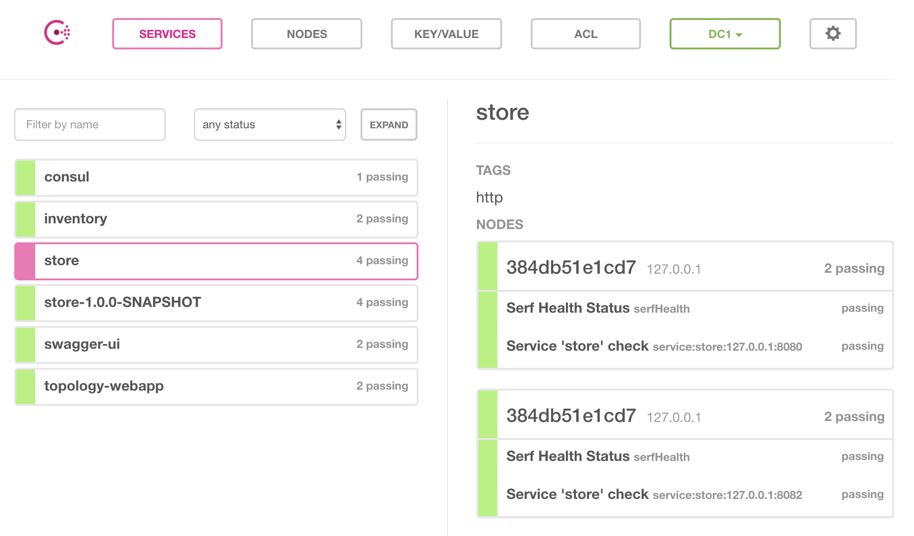

:noaudio:
:scrollbar:
:data-uri:
:toc2:

== Lab 5: Service discovery and fault tolerance with WildFly Swarm

In this lab, you will use WildFly Swarm's _Topology_ features to advertise the existence of individual microservices,
perform service discovery, and provide client-side load balancing while calling the services. You will also use
fault tolerance techniques to provide fallback capabilities in the event of service failure.

You will initially write a pure WildFly Swarm application with the above features, and then move the application
onto OpenShift with no changes, using WildFly Swarm's OpenShift / Kubernetes Toplogy support.

.Requirements

* Familiarity with Java programming
* Knowledge of OpenShift concepts
* Familiarity with microservices concepts

:numbered:

== Find lab5 project files

Each lab in this course is housed in separate directories. Using the command line, find and observe
the files for this lab:

    % cd $HOME/rhoar-enablement/lab5

IMPORTANT: Be sure to replace `$HOME` with the directory you chose to put the content in previous labs.

== Overview

The project now contains two separate microservices which you will tie together using WildFly Swarm and microservice
integration principles. The two projects are in two different directories `inventory` and `store`:

. The `inventory` service. This is the same project from previous labs which exposes a RESTful endpoint for determining
inventory availability for retail products.
. The `store` service. This is a new microservice which exposes a RESTful endpoint for determining whether a given
retail store location is open or closed. When called it returns a simple JSON object with a boolean indicating
`true` (store open) or `false` (store closed).

You will tie these two services together, so that eventually it will look something like this:

The _inventory_ service will return inventory information just as before, but it will also call the _store_
service and enrich the description of the inventory to indicate whether the retail store is OPEN or CLOSED.

=== Concepts

The concept of _service discovery_ becomes important when you have more than one microservice and more than one
instance of each. Distributed microservices also require you to have a plan in place if services fail (or worse, continue to
work but unable to meet required service levels). There are various patterns, such as client-side discovery,
server-side discovery, load balancing and fault tolerance techniques, and much more.

TIP: For much more information on microservices architectures and the tradeoffs they introduce as opposed to
monolithic architectures, check out https://developers.redhat.com/blog/tag/microservices/[Red Hat's blog post series on Microservices].

WildFly Swarm enables service discovery and load balancing through it's Topology feature and related support for
Consul (discovery), JGroups (discovery), and OpenShift's service abstractions. WildFly Swarm also provides resilience and fault tolerance through its
integration with Netflix OSS (e.g. Ribbon for client-side load balancing or Hystrix for circuit breaking).

==== Topologies

When building systems of many microservices, being able to locate, discovery and interact with them in an
ever-changing deployment environment can become a challenge. There are many solutions to managing a topology of
services, each with this own trade-offs.

In a pure WildFly scenario, in an environment where multicast is available, many users rely upon Eureka,
JGroups, and other frameworks to handle discovery and reliable communications between nodes. In other scenarios,
either due to the lack of multicast, heterogenuity of services, or scaling concerns, different service-discovery
mechanisms are used. These may include services such as Apache Zookeeper or https://www.consul.io/[Hashicorp’s Consul].

WildFly Swarm attempts to abstract away the many ways of handling service registration and discovery through its
topology fraction. These fractions add the necessary APIs and implementations to your projects to be able to
discover and communicate with components of your application.

TIP: For more information about WildFly Swarm's Topology feature, consult the https://wildfly-swarm.gitbooks.io/wildfly-swarm-users-guide/content/v/2017.7.0/advanced/topology.html[User Guide].

== Add Topology fraction dependencies

The features implemented in this exercise require a couple of new Fraction dependencies for each of the two services.

. Open the store service's `store/pom.xml` file and add these dependencies, just below the existing Fraction
dependencies (look for the `<!-- Add additional dependencies here -\->` comment):

[source, xml]
        <dependency>
            <groupId>org.wildfly.swarm</groupId>
            <artifactId>topology</artifactId>
        </dependency>
        <dependency>
            <groupId>org.wildfly.swarm</groupId>
            <artifactId>topology-consul</artifactId>
        </dependency>
        <dependency>
            <groupId>org.wildfly.swarm</groupId>
            <artifactId>ribbon</artifactId>
        </dependency>

This adds the Topology API (`topology`), the https://www.consul.io/[Hashicorp Consul] implementation of that API (`topology-consul`),
and the Netflix Ribbon integration (`ribbon`) which provides client-side load balancing.

The inclusion of Ribbon also transitively brings in other dependencies like https://github.com/Netflix/Hystrix[Netflix Hystrix] which you will use
 later on.

. Open the `inventory/pom.xml` file and add the same dependencies, plus one for `topology-webapp`, which will expose a
JavaScript library for web developers to use when interfacing with the backend microservices:

[source, xml]
        <dependency>
            <groupId>org.wildfly.swarm</groupId>
            <artifactId>topology</artifactId>
        </dependency>
        <dependency>
            <groupId>org.wildfly.swarm</groupId>
            <artifactId>topology-consul</artifactId>
        </dependency>
        <dependency>
            <groupId>org.wildfly.swarm</groupId>
            <artifactId>ribbon</artifactId>
        </dependency>
        <dependency>
            <groupId>org.wildfly.swarm</groupId>
            <artifactId>topology-webapp</artifactId>
        </dependency>

. Save both files

== Enable REST endpoint advertisements for Store service

In order to be discoverable, a service must declare itself as such. With WildFly Swarm, you can https://wildfly-swarm.gitbooks.io/wildfly-swarm-users-guide/content/v/2017.7.0/advanced/topology.html[do so programmatically]
in a custom `main()` method, or you can do so declaratively using the `@org.wildfly.swarm.topology.Advertise` annotation.

. Open the `store/src/main/java/com/redhat/coolstore/rest/StoreEndpoint.java` file, and add the class-level annotation so that the
top of the class definition looks like:

[source, java]
  @Advertise("store")
  @Path("/store")
  public class StoreEndpoint {

Notice the name used "store". This will be referenced later on and corresponds to the load-balanced name of the service that
can be referenced by Ribbon/Consul clients to discover and load-balance across multiple instances of this service.

. Don't forget to add the necessary `import org.wildfly.swarm.topology.Advertise;` directive!

. Save the file

== Add Store Service definition

The _inventory_ service must be taught how to find and communicate with our new _store_ service.

. Create a new file `inventory/src/main/java/com/redhat/coolstore/service/StoreService.java` which will define how
to find it, how to call it, and what to do when it's not working:

[source, java]
----
package com.redhat.coolstore.service;

import com.netflix.ribbon.Ribbon;
import com.netflix.ribbon.RibbonRequest;
import com.netflix.ribbon.proxy.annotation.*;
import io.netty.buffer.ByteBuf;

@ResourceGroup( name="store" )
public interface StoreService {

    StoreService INSTANCE = Ribbon.from(StoreService.class);

    @TemplateName("storeClosed")
    @Http(
            method = Http.HttpMethod.GET,
            uri = "/api/store/{location}"
    )
    @Hystrix(
            fallbackHandler = StoreServiceFallback.class
    )
    RibbonRequest<ByteBuf> storeClosed(@Var("location") String location);

}
----

. `@ResourceGroup(name="store")` defines how to find the service
. `Ribbon.from()` fetches a load balanced instance of the service for calling later on
. `@Http` defines the API endpoint and template for use when calling the service
. `@Hystrix` defines what to do when the service is unavailable (the _fallback_ behavior). You may get an error in your IDE
since you've not defined the `StoreServiceFallback.class` yet.
. Finally, the Java API for calling the service is declared.

TIP: Notice the use of Ribbon-specific and `io.netty` classes. These implement load balancing and
asynchronous event-driven calling of APIs. For more information on how asynchronous method calls
work with Ribbon, check out https://github.com/Netflix/ribbon/wiki/Features[the docs].

== Change inventory service to call Store service

In earlier exercises, the inventory service simply fetched a row from a database and returned a JSON object
representing that row. As this exercise involves service discovery, we have introduced a new service and need
to modify the _inventory_ service to call it. We will do so using an asynchronous call which returns a
_Future_ object. When this object _completes_, results will be returned to the original caller.

Asynchronous event-driven calls combined with high performance non-blocking I/O (through Netty) result in high
performance applications that can handle significant loads without loss of service.

. Open the `inventory/src/main/java/com/redhat/coolstore/rest/InventoryEndpoint.java` file

. Change the implemention to the below:

[source, java]
----
package com.redhat.coolstore.rest;

import javax.enterprise.context.RequestScoped;
import javax.inject.Inject;
import javax.ws.rs.GET;
import javax.ws.rs.Path;
import javax.ws.rs.PathParam;
import javax.ws.rs.Produces;
import javax.ws.rs.container.AsyncResponse;
import javax.ws.rs.container.Suspended;
import javax.ws.rs.core.Context;
import javax.ws.rs.core.MediaType;
import javax.ws.rs.core.UriInfo;

import com.fasterxml.jackson.core.JsonFactory;
import com.fasterxml.jackson.core.JsonParser;
import com.fasterxml.jackson.databind.ObjectMapper;
import com.fasterxml.jackson.databind.ObjectReader;
import com.redhat.coolstore.model.Inventory;
import com.redhat.coolstore.model.Store;
import com.redhat.coolstore.service.InventoryService;
import com.redhat.coolstore.service.StoreService;
import io.netty.buffer.ByteBufInputStream;
import org.wildfly.swarm.topology.Advertise;

import java.io.IOException;

@RequestScoped
@Advertise("inventory")
@Path("/inventory")
public class InventoryEndpoint {

    private final StoreService storeService;

    @Context
    private UriInfo uriInfo;

    @Inject
    private InventoryService inventoryService;

    public InventoryEndpoint() {
        this.storeService = StoreService.INSTANCE;
    }

    @GET
    @Path("/{itemId}")
    @Produces(MediaType.APPLICATION_JSON)
    public void getAvailability(@PathParam("itemId") String itemId,
                                @Suspended AsyncResponse asyncResponse) {
        Inventory i = inventoryService.getInventory(itemId);
        String myAddress = uriInfo.getBaseUri().toASCIIString();

        storeService.storeClosed(i.getLocation()).toObservable().subscribe(
            (result) -> {
                try {
                    ObjectMapper mapper = new ObjectMapper();
                    ObjectReader reader = mapper.reader();
                    JsonFactory factory = new JsonFactory();
                    JsonParser parser = factory.createParser(new ByteBufInputStream(result));
                    Store store = reader.readValue(parser, Store.class);
                    Boolean isOpen = store.isOpen();
                    String storeAddress = store.getAddress();

                    i.setLocation(i.getLocation() + " [STORE IS " + (isOpen ? "OPEN" : "CLOSED") +
                            " inventory:" + myAddress +
                            " store:" + storeAddress + "]");
                    asyncResponse.resume(i);
                } catch (IOException e) {
                    System.err.println("ERROR: " + e.getLocalizedMessage());
                    asyncResponse.resume(e);
                }
            },
            (err) -> {
                System.err.println("ERROR: " + err.getLocalizedMessage());
                asyncResponse.resume(err);
        });

    }
}
----

. The `@Advertise` annotation causes the service to be advertised via Ribbon/Consul.
. In the `getAvailability()` method, we first get the inventory item from the database as before.
. Next, the `storesClosed()` API is called to determine whether the store holding the inventory is open or closed.
. This is method call goes through Ribbon to call the other service (the _store_ service) through an asynchronous invocation (using the _Observable_ pattern and JAX-RS's http://docs.oracle.com/javaee/7/api/javax/ws/rs/container/AsyncResponse.html[AsyncResponse] API.
. If the call is successful, the `(result)` function is called, which parses the result and adds STORE IS OPEN / STORE IS CLOSED messaging to the inventory object.
. If the call fails, then through the use of Hystrix, the fallback mechanism is called which you will define next.

TIP: For more information on high performance application design and Java, see the https://dzone.com/articles/javautilconcurrentfuture[DZone article on Java Futures].

== Implement the Store service fallback

In the https://martinfowler.com/bliki/CircuitBreaker.html[Circuit Breaker] pattern, services which are failing or have failed can
be _short-circuited_, allowing the service time to recover before being accessed. During that time, the circuit is said to be _open_
and any calls to it are short-circuited to the _fallback_ mechanism. Define the fallback for this lab:

. Create a new file `inventory/src/main/java/com/redhat/coolstore/service/StoreServiceFallback.java` with the fallback logic:

[source, java]
----
package com.redhat.coolstore.service;

import com.fasterxml.jackson.databind.ObjectMapper;
import com.fasterxml.jackson.databind.ObjectWriter;
import com.netflix.hystrix.HystrixInvokableInfo;
import com.netflix.ribbon.hystrix.FallbackHandler;
import com.redhat.coolstore.model.Store;
import io.netty.buffer.ByteBuf;
import io.netty.buffer.ByteBufOutputStream;
import io.netty.buffer.UnpooledByteBufAllocator;
import rx.Observable;

import java.io.IOException;
import java.util.Map;

public class StoreServiceFallback implements FallbackHandler<ByteBuf> {
    @Override
    public Observable getFallback(HystrixInvokableInfo<?> hystrixInvokableInfo, Map<String, Object>  requestProps) {

        String location = (String)requestProps.get("location");

        Store fallbackStore = new Store(location, false, "FALLBACK");

        ObjectMapper mapper = new ObjectMapper();
        ObjectWriter writer = mapper.writer();
        ByteBuf byteBuf = UnpooledByteBufAllocator.DEFAULT.buffer();
        ByteBufOutputStream bos = new ByteBufOutputStream(byteBuf);
        try {
            writer.writeValue(bos, fallbackStore);
        } catch (IOException e) {
            e.printStackTrace();
        }
        return Observable.just(byteBuf);
    }
}
----

This simple fallback will generate a valid response as though the call to the Store service worked, but it will always
indicate that the store is closed. This will allow normal application behavior, and not require any special error handling
in the application making the call to our services.

With the services defined and fallbacks in place, it's time to test out our new app!

== Start Consul

Microservices need a way to register and discover other microservices, For this exercise, you will run a
pure WildFly Swarm application, using Consul as our service discovery / service registry. When
our microservices start up, they will register themselves under a name in Consul. When microservices need
to contact other microservices, they will use Consol to look up (and Ribbon to load balance across instances).

. Open a terminal window and start the Consul server using a container image available from Docker Hub:

[source, bash]
% docker run -p 8500:8500 consul

This will execute the Consul server and expose its port 8500 to other applications. You should see success messages and no errors.

----
==> Starting Consul agent...
==> Consul agent running!
           Version: 'v0.9.0'
           Node ID: '871ac49a-6b2e-06c3-8dcb-0732e16a9e22'
         Node name: '384db51e1cd7'
        Datacenter: 'dc1'
            Server: true (bootstrap: false)
       Client Addr: 0.0.0.0 (HTTP: 8500, HTTPS: -1, DNS: 8600)
      Cluster Addr: 127.0.0.1 (LAN: 8301, WAN: 8302)
    Gossip encrypt: false, RPC-TLS: false, TLS-Incoming: false
----

== Run standalone WildFly Swarm app and test discovery and fallback

. Open another terminal window and run the store service. Note that you must bind to a real IP address for discovery purposes,
so make note of the use of `swarm.bind.address`.

[source, bash]
----
% cd store; mvn clean wildfly-swarm:run -Dswarm.bind.address=127.0.0.1
----

. You should see the Store service come up and register itself with Consul/Ribbon:
----
2017-08-01 17:34:21,671 INFO  [org.wildfly.swarm.topology.consul.runtime.Advertiser] (MSC service thread 1-4) Registered service store:127.0.0.1:8080
----

. You should also see output from Consul, such as:
----
    2017/08/01 21:34:21 [DEBUG] agent: Check 'service:store:127.0.0.1:8080' in sync
    2017/08/01 21:34:21 [DEBUG] http: Request GET /v1/catalog/services?wait=60s&index=5 (1.19100631s) from=172.17.0.1:58790
    2017/08/01 21:34:21 [DEBUG] http: Request GET /v1/health/service/consul?passing=true&wait=5s&index=6 (2.186564138s) from=172.17.0.1:58788
    2017/08/01 21:34:21 [DEBUG] agent: Node info in sync
    2017/08/01 21:34:21 [DEBUG] http: Request PUT /v1/agent/service/register (3.515784ms) from=172.17.0.1:58794
    2017/08/01 21:34:21 [DEBUG] agent: Service 'store:127.0.0.1:8080' in sync
----

. Quickly test the store endpoint to ensure it is working:

[source, bash]
% curl http://localhost:8080/api/store/raleigh
{"location":"raleigh","open":false,"address":"http://localhost:8080/api/store/raleigh,10.16.196.131"}

Due to the logic in the `StoreEndpoint` class, any store named `Raleigh` (or `raleigh` or `RaLeIgH`) will be deemed
`CLOSED`. All other stores are `OPEN`. What's up with Raleigh??

Also note the IP address and endpoint information is included in the address of the store. We will use this in the next section
to observe changing IPs when load balancing.

. Open another terminal window and run the inventory service:

[source, bash]
$ cd inventory; mvn clean wildfly-swarm:run -Dswarm.bind.address=127.0.0.1 -Dswarm.port.offset=1

Notice the use of `swarm.port.offset`. Since the _store_ service is already running on port `8080`, we must tell Swarm
to move all ports, so that using an offset of `1` means that our _inventory_ service will be accessible on port `8081`. Test it out:

[source, bash]
% curl http://localhost:8081/api/inventory/329299
{"itemId":"329299","location":"Raleigh [STORE IS CLOSED inventory:http://localhost:8081/api/ store:http://127.0.0.1/api/store/Raleigh,10.16.196.131]","quantity":736,"link":"http://maps.google.com/?q=Raleigh"}

Now test it again for a different product in _Tokyo_:

[source, bash]
% curl http://localhost:8081/api/inventory/444436
{"itemId":"444436","location":"Tokyo [STORE IS OPEN inventory:http://localhost:8081/api/ store:http://127.0.0.1/api/store/Tokyo,10.16.196.131]","quantity":230,"link":"http://maps.google.com/?q=Tokyo"}

Indeed, only Raleigh is closed.

== Run another instance

To test the load balancing capabilities of WildFly Swarm, open yet another terminal window and run a second copy of the _store_ runtime:

[source, bash]
% cd store; mvn wildfly-swarm:run -Dswarm.bind.address=127.0.0.1 -Dswarm.port.offset=2

After this command is run, we'll have the following services running:

|===
|Service|Port

|Consul
|8500

|Store instance 1
|8080
|Store instance 2
|8082
|Inventory
|8081

|===

TIP: Consul also includes a built-in web console for visualizing the various services that can be discovered. Visit
`http://localhost:8500` in your browser to see the console: 

. Repeatedly call the Inventory service, and observe the load balancing by seeing that the port number of the store service is different across invocations:

== Break the circuit

To test the circuit breaking capability, carefully stop both instances of the _store_ service (press CTRL-C in the terminals
in which they run).

Once they both stop, re-attempt to access the _inventory_ service. Because the _store_ service has failed, the fallback mechanism will
kick in and you should see this in the message returned:

[source, bash]
% curl http://localhost:8081/api/inventory/444436
{"itemId":"444436","location":"Tokyo [STORE IS CLOSED inventory:http://localhost:8081/api/ store:FALLBACK]","quantity":230,"link":"http://maps.google.com/?q=Tokyo"}

Notice that all stores are `CLOSED` and the address of the store is `FALLBACK`.

Restart one of the stopped _store_ services. After a few seconds, retry the _inventory_ service again, and the fallback should no longer be used.

[TIP]
====
Many of the timeout parameters of the Hystrix fraction can be controlled and customized through swarm properties.
For example, to change the amount of time Hystrix will wait before re-attempting to close the circuit you can specify the following
property (using one of the many https://wildfly-swarm.gitbooks.io/wildfly-swarm-users-guide/content/v/2017.7.0/configuration_properties.html[configuration mechanisms] of WildFly Swarm):

`swarm.hystrix.command.default.circuitBreaker.sleepWindowInMilliseconds=5000`

Consult the https://reference.wildfly-swarm.io/v/2017.7.0/fractions/hystrix.html[Hystrix Fraction docs] and https://github.com/Netflix/Hystrix/wiki/Configuration[Hystrix docs] for more options.
====

== Change fraction dependencies

Thanks to WildFly Swarm's Topology abstraction, moving existing applications between different
environments requires no code changes - as long as there is a Fraction that provides the implementation
of Toploogy, your code can move unmodified to it.

In this example we'll take our working pure WildFly Swarm application and move it to OpenShift.

OpenShift takes care of many of the service discovery and load balancing functions previously
provided by Ribbon and Consul, however the WildFly Swarm API is abstracted so no code changes
are required - your app will transparently use the services provided by OpenShift.

To demonstrate this, modify both the `store/pom.xml` and `inventory/pom.xml` Maven build files
to change the fraction dependency from `topology-consul` to `topology-openshift`. The final
dependency for each should look like:

[source, xml]
        <dependency>
            <groupId>org.wildfly.swarm</groupId>
            <artifactId>topology-openshift</artifactId>
        </dependency>

== Deploy to OpenShift

That's all there is to it. To deploy to OpenShift:

. Make sure you're logged in:

[source, bash]
% oc login https://console.training.rhmw.org:8443 -u USER -p PASS

Be sure to replace `USER` and `PASS` with your supplied credentials and accept any security exceptions (which is never
a good idea in a production scenario, but is fine for this lab).

You should get a `Login successful` message indicating you've successfully logged in.

. Create a new project to house your new services:

[source, bash]
% oc new-project lab5-userXX

Be sure to replace `userXX` with your username.

. The WildFly Swarm `topology-openshift` fraction needs permission to be able to access the cluster
information from OpenShift. To enable this permission in your new project, execute the following:

[source, bash]
% oc policy add-role-to-user view system:serviceaccount:$(oc project -q):default -n $(oc project -q)

This ensures that the default service account for this project has the cluster `view` permission, enabling the fraction
to subscribe to and act on services coming and going.

. Deploy the _store_ service:

[source, bash]
% cd store; mvn clean package fabric8:build fabric8:deploy

. Retrieve the route hostname to the _store_service:

[source, bash]
% oc get route store
NAME      HOST/PORT                           PATH      SERVICES   PORT      TERMINATION   WILDCARD
store     store-lab5.apps.127.0.0.1.nip.io              store      8080                    None

. And test it:

[source, bash]
% curl http://HOSTNAME/api/store/raleigh
{"location":"raleigh","open":false,"address":"http://store-labs5.apps.127.0.0.1.nip.io/api/store/raleigh,172.17.0.7"}

Be sure to replace `HOSTNAME` with your actual hostname from the `oc get route` command.

. Deploy the _inventory_ service:

[source, bash]
% cd store; mvn clean package fabric8:build fabric8:deploy

. Retrieve the route hostname to the _inventory_service:

[source, bash]
% oc get route inventory
NAME        HOST/PORT                             PATH      SERVICES    PORT      TERMINATION   WILDCARD
inventory   inventory-lab5.apps.127.0.0.1.nip.io            inventory   8080                    None

. Exercise the _inventory_ service:

[source, bash]
% curl http://HOSTNAME/api/inventory/329299
{"itemId":"329299","location":"Raleigh [STORE IS CLOSED inventory:http://inventory-labs5.apps.127.0.0.1.nip.io/api/ store:http://store/api/store/Raleigh,172.17.0.7]","quantity":736,"link":"http://maps.google.com/?q=Raleigh"}

Be sure to replace `HOSTNAME` with your actual hostname from the `oc get route` command.

== Test the circuit breaker in OpenShift

. To test the circuit breaker within OpenShift, scale the _store_ service to 0 using the GUI or the CLI:

[source, bash]
% oc scale --replicas=0 dc/store

. Re-test the _inventory_ service to witness the fallback execution:

[source, bash]
% curl http://HOSTNAME/api/inventory/329299
{"itemId":"329299","location":"Raleigh [STORE IS CLOSED inventory:http://inventory-labs5.apps.127.0.0.1.nip.io/api/ store:FALLBACK]","quantity":736,"link":"http://maps.google.com/?q=Raleigh"}

. Scale the _store_ service to 3 pods:

[source, bash]
% oc scale --replicas=3 dc/store

After a few seconds, repeatedly test the _inventory_ service to ensure that the fallback is not employed
and that the automatic load balancing causes requests to be sent to all 3 of the _store_ service instances
by watching the IP address reported by the _store_ service's `address` field in the returned JSON object.

NOTE: Depending on server load you may get 'stuck' to a specific instance of the _store_ service. Wait a minute or two and try again.

